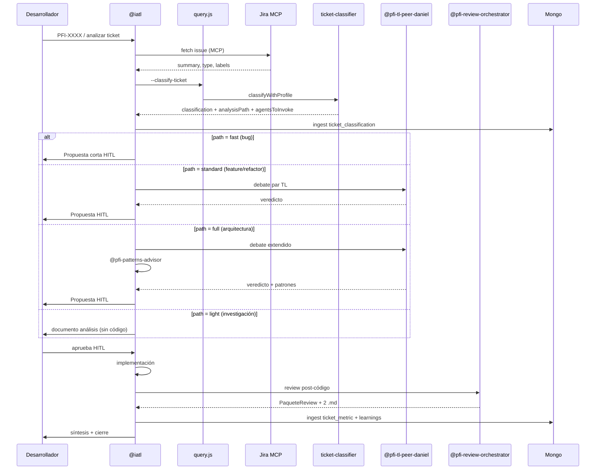
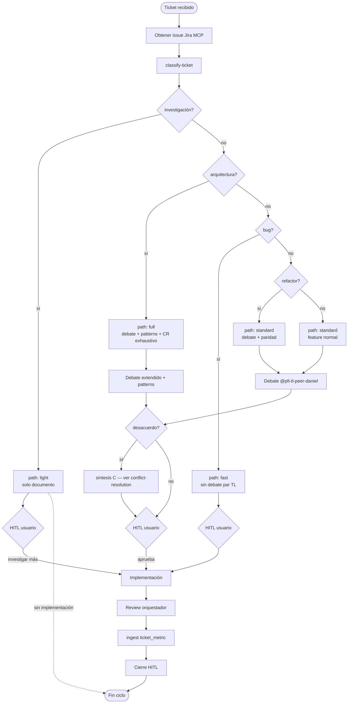

# Diagramas de arquitectura IATL

Visualización de componentes, secuencias y decisiones. Complementa [overview.md](overview.md) y [pipeline.md](pipeline.md).

---

## 1. Diagrama de componentes

```mermaid
flowchart TB
  subgraph Human["Capa humana"]
    DEV[Desarrollador César]
  end

  subgraph Runtime["Runtime portable"]
    CLI[iatl-install CLI]
    CUR[Cursor ~/.cursor]
    VSC[VS Code ~/.iatl]
    CC[Claude Code ~/.claude/iatl]
    AG[Antigravity ~/.antigravity]
    DKR[Docker stack]
  end

  subgraph Orquestacion["Orquestación"]
    IATL[@iatl]
  end

  subgraph Gates["Gates especializados"]
    TL[@pfi-tl-peer-daniel]
    RO[@pfi-review-orchestrator]
    CR[@pfi-cr-analyst]
    BB[Bugbot]
    PA[@pfi-patterns-advisor]
  end

  subgraph Hub["Hub conocimiento"]
    MONGO[(MongoDB operativo)]
    CHROMA[(ChromaDB semántico)]
    TC[ticket_classifications]
    TM[ticket_metrics]
  end

  subgraph External["Externos"]
    JIRA[Jira MCP]
    WEB[Fuentes web curadas]
  end

  DEV <-->|HITL| IATL
  CLI --> CUR & VSC & CC & AG & DKR
  CUR & VSC & CC & AG & DKR --> IATL

  IATL --> TL
  IATL --> RO
  RO --> CR
  RO --> BB
  IATL -.->|foco patrones| PA

  IATL --> MONGO
  TL --> MONGO
  CR --> MONGO
  MONGO --> CHROMA

  MONGO --- TC
  MONGO --- TM

  IATL --> JIRA
  TL --> WEB
```

---

## 2. Diagrama de secuencia — ciclo ticket completo



---

## 3. Flujo de decisiones — clasificación y nivel de análisis



---

## 4. Flujo de decisiones — resolución de conflictos

```mermaid
flowchart TD
  CONFLICT([Desacuerdo detectado]) --> TYPE{Tipo de conflicto}

  TYPE -->|@iatl ↔ Daniel| PEER[Protocolo peer gate deadlock]
  TYPE -->|CR ↔ Bugbot| CRBB[Matriz prioridad @iatl]
  TYPE -->|@iatl ↔ CR analyst| CRATL[Escalar a HITL con evidencia]
  TYPE -->|Patterns ↔ TL| PAT[Daniel tiene veto arquitectura]

  PEER --> ABC[Registrar A, B → generar C]
  ABC --> EVAL[Evaluar diff/paridad/SOLID]
  EVAL --> ONE[Una Propuesta HITL recomendada]

  CRBB --> CRIT{Bug crítico Bugbot?}
  CRIT -->|sí| BLOCK[Bloquear commit]
  CRIT -->|no| CRWIN[Priorizar CR si arquitectura]

  CRATL --> HITL[Usuario decide con matriz]

  PAT --> DANIEL[Veredicto Daniel prevalece en deuda diferida]

  ONE --> MONGO[(peer_discussions)]
  BLOCK --> MONGO
  CRWIN --> MONGO
  HITL --> MONGO
  DANIEL --> MONGO
```

Ver [../docs/agent-conflict-resolution.md](../docs/agent-conflict-resolution.md) para procedimientos detallados.

---

## Referencias

- [ticket-classification.md](ticket-classification.md) — perfiles por tipo
- [quality-metrics.md](quality-metrics.md) — métricas del ciclo
- [pipeline.md](pipeline.md) — flujo textual
