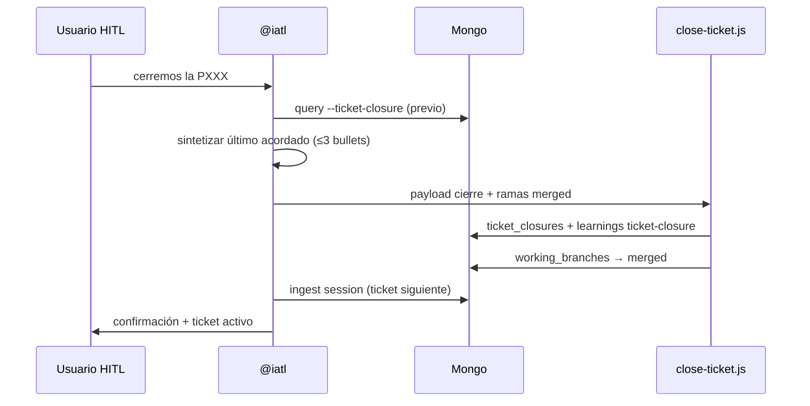

# Visión — Arquitectura de agentes PFI

## Problema

Entregas rápidas con deuda estructural (curva feat → fix bajo presión) degradan develop. El orquestador IATL necesita un **par revisor** con criterio TL antes de presentar soluciones al desarrollador, y **memoria persistente** por sprint para no perder acuerdos HITL.

## Solución

Tres capas de inteligencia cooperativa + hub Mongo:

| Capa | Agente / artefacto | Perfil |
|------|-------------------|--------|
| Orquestación + HITL | @iatl | César — hexagonal estricto, spec-driven |
| Gate pre-HITL | @pfi-tl-peer-daniel | Daniel TL — pragmático, diff mínimo |
| Gate post-código | @pfi-review-orchestrator | CR Claude + Bugbot |
| Memoria sprint | Hub Mongo + `close-ticket.js` | Cierres HITL con retención parametrizable |
| Fuentes issue | `pfi-ticket-source-resolver` | MCP-first Jira/… por número de historia |
| Recall semántico | Chroma local v2.0 | Similitud learnings/CR — ver knowledge-layer-chroma.md |

## Principios

1. **Una interfaz humana:** solo @iatl habla con el desarrollador.
2. **Debate obligatorio:** toda Propuesta pasa por par TL antes de HITL.
3. **Memoria persistente:** Mongo indexa contexto; @iatl mejora sesión a sesión.
4. **Cierre autónomo:** al confirmar HITL cierre ticket → `close-ticket.js` + learnings sprint.
5. **Fuentes externas:** URLs curadas por categoría (patrones, Node, REST, AWS).
6. **Anti-patrón explícito:** curva Carlos documentada — no replicar.

## Jerarquía completa

```mermaid
flowchart TB
  subgraph HITL["Capa humana"]
    U[Desarrollador César]
  end

  subgraph Orquestacion["Orquestación"]
    IATL[@iatl]
  end

  subgraph Gates["Gates especializados"]
    TL[@pfi-tl-peer-daniel<br/>pre-HITL]
    RO[@pfi-review-orchestrator<br/>post-código]
    CR[@pfi-cr-analyst]
    BB[Bugbot]
    PA[@pfi-patterns-advisor<br/>foco explícito]
  end

  subgraph Memoria["Hub Mongo iatl_knowledge"]
    Mongo[(MongoDB local)]
    WB[working_branches]
    TC[ticket_closures]
    LR[learnings]
    PD[peer_discussions]
    KS[knowledge_sources]
  end

  subgraph Config["Config sprint"]
    CFG[config.json<br/>project · sprintLabel · retentionDays]
  end

  U <-->|debate / OK HITL| IATL
  IATL --> TL
  IATL --> RO
  RO --> CR
  RO --> BB
  IATL -.->|foco patrones| PA

  IATL --> Mongo
  TL --> Mongo
  CR --> Mongo
  RO --> Mongo

  Mongo --- WB
  Mongo --- TC
  Mongo --- LR
  Mongo --- PD
  Mongo --- KS

  CFG --> TC
  CFG --> LR

  IATL -->|cierre autónomo| Close[close-ticket.js]
  Close --> TC
  Close --> LR
  Close --> WB
```

## Flujo de datos por sprint



## Alcance repo vs ~/.cursor

| Qué | Operativo | Copia versionada |
|-----|-----------|------------------|
| Código lambdas | `pfi-backend-core/src/lambda/` | — |
| Agentes/skills/hub | `~/.cursor/` | `pfi-agent-architecture/` |
| Specs ticket | `docs/spec-driven/` (gitignored local) | workflow.md |

Ver [LOCATIONS.md](../LOCATIONS.md).
